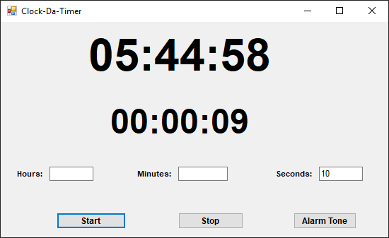

# Clock-Da-Timer
Simple Basic Winform App that Displays Current System Clock, while also has a Timer with the option of choosing desired Mp3 file as alarm tone

  - Have a side Clock
  - Create personalised Alarm

# New Features!
  - V-1.0 - added System Clock and Timer , Alarm tone Mp3 choice 

# Version & Features Highlights
 * V-1.0 - Basic Clock & Timer -with Dialog for choosing favorite Mp3 file
 
 

 
 

### Tech

Clock-Da-Timer Uses simple basic tools:

* [MetroModernUI 1.4.0(To be used in future Release)] - Metro Modern UI or MetroFramework brings Windows 8 UI to .NET Windows Forms applications.
* [.NET 4.5.2] - .Net Frame Work.
* [Win Forms] - Windows Forms for creating Windows Application.

### Installation

Not Much Needed Just run the release and your Good to Go!

### Development

Want to contribute? Great!

Just make a Pull Request and make your magic!

### Todos

 - Reboot the Design to Metro UI
 - Implement Stopwatch Functionality
 - switch for Dark & Light Modes
 - App window scaling freely
 - Fix arising bugs

License
----

MIT

**Free Software, Hell Yeah!**
